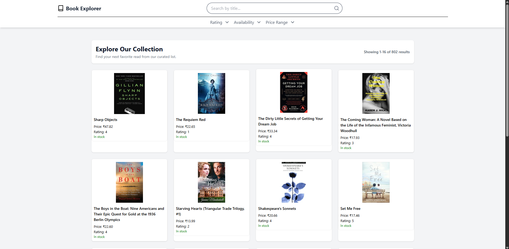

<h1 align="center">🚀 <a href="https://book-explorer-14.onrender.com/" target="_blank">Live Demo</a> 🚀</h1>
# 🚀 [Live Demo](https://book-explorer-14.onrender.com/)


# 🚀 Live Demo

[](https://book-explorer-14.onrender.com/)


<p align="center">
  
</p>


# 📚 Book Explorer

Book Explorer is a full-stack web application that scrapes book data from an external site, stores it (in JSON or MongoDB), and provides a searchable and browsable interface for customers.

---

## 🗂 Project Structure

```
book-explorer/
│── scraper/   # Node.js + Axios + Cheerio scraper script
│── backend/   # Express.js backend (API + MongoDB or JSON storage)
│── frontend/  # React + Vite frontend (book explorer UI)
```

---

## 🚀 Quick Start (Local Setup)

### 1️⃣ Run the Scraper
```bash
cd scraper
npm install
```

- Create a `.env` file (optional, for MongoDB connection) → see `.env.example`.
- Run the scraper:
```bash
node scraper.js
```
This will create a `books.json` file in `/scraper`.  
If `MONGO_URI` is provided, data will also be upserted into MongoDB.

---

### 2️⃣ Start the Backend
```bash
cd backend
npm install
```

- Create a `.env` file (optional) → see `.env.example`.
- Run the server:
```bash
node index.js
```

👉 API will be served at: `http://localhost:5000`

---

### 3️⃣ Launch the Frontend
```bash
cd frontend
npm install
npm run dev
```

👉 Open the Vite dev server (usually `http://localhost:5173`).

---

## 🔗 API Endpoints

- `GET /api/books` → Fetch all books  
- `POST /api/refresh` → Trigger scraper (only works if Node + paths are configured)  

---

## 📝 Notes
- If you don’t configure MongoDB, the backend will read from `scraper/books.json`.
- The project is modular — scraper, backend, and frontend can run independently.
- Built with:
  - **Scraper:** Node.js, Axios, Cheerio
  - **Backend:** Express.js, MongoDB (optional)
  - **Frontend:** React (Vite, Tailwind optional)

---


---

## 📜 License
MIT
